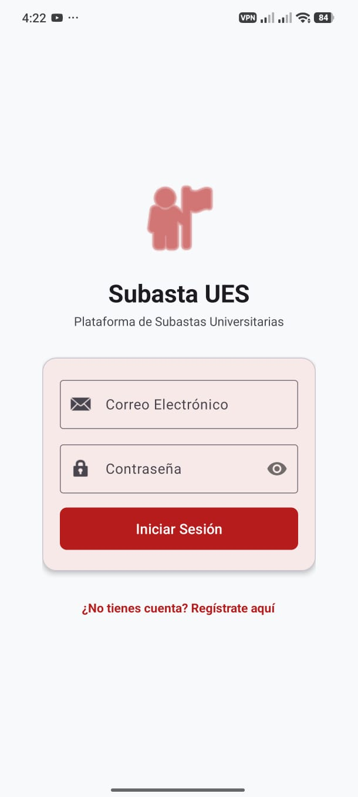
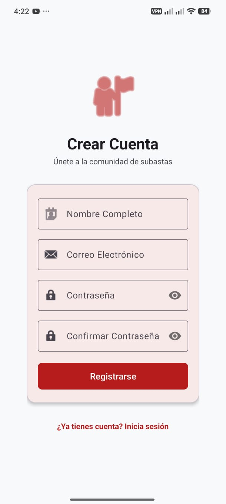
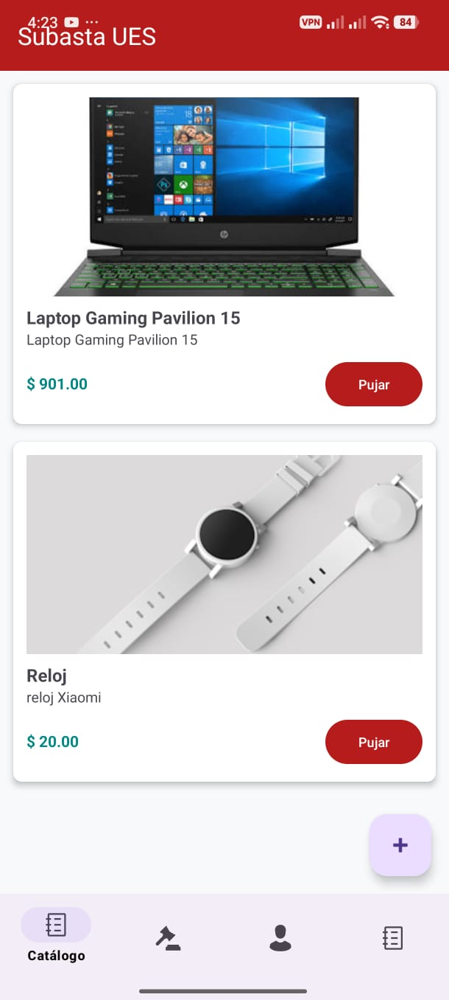
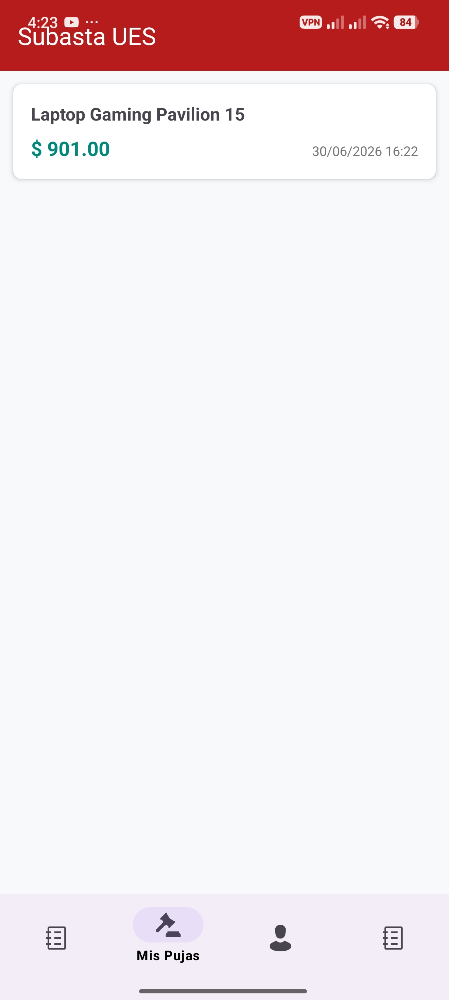
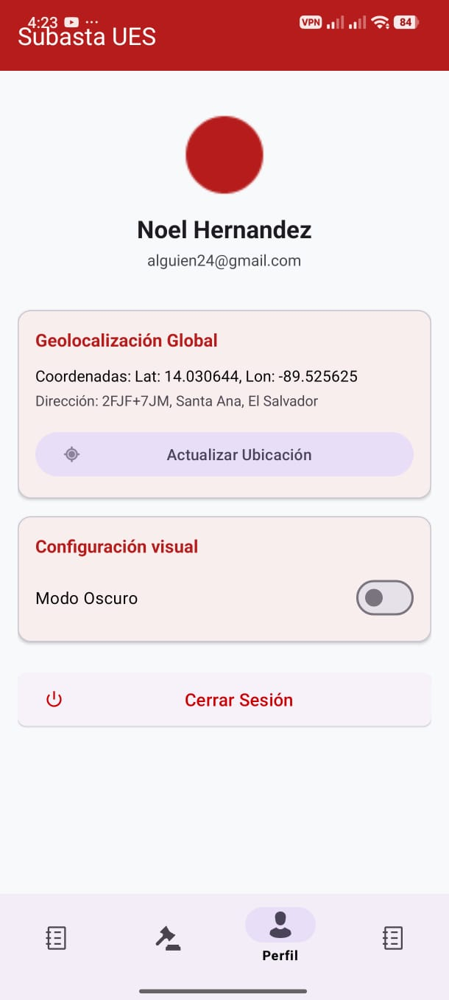
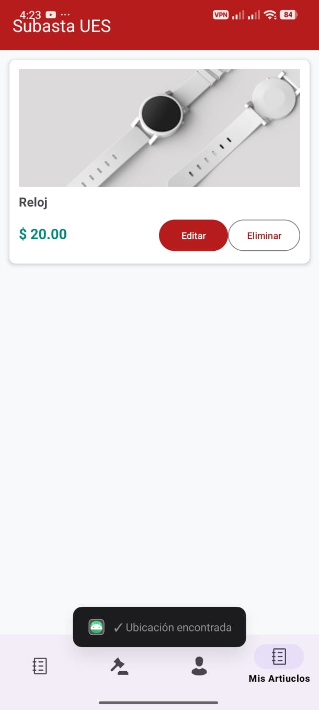

**SUBASTAS UES**

Aplicación móvil desarrollada en **Android Studio** para la gestión de subastas en tiempo real entre estudiantes y usuarios registrados.

## Funcionalidades
- **Registro de usuarios:** Gestión de cuentas para participantes.
- **Creación de subastas:** Los usuarios pueden publicar productos incluyendo imagen, descripción y precio base.
- **Sistema de pujas:** Interfaz dinámica para que otros usuarios visualicen los productos y realicen sus pujas en tiempo real.

## Tecnologías utilizadas
- **Lenguaje:** Java 
- **IDE:** Android Studio
- **Base de Datos:** SQLite (Persistencia de datos local)

## Cómo ejecutar el proyecto
1. Clona este repositorio: `git clone https://github.com/retro2047/SubastaUes`
2. Abre el proyecto en **Android Studio**.
3. Sincroniza las dependencias de **Gradle (versión mínima: [indica aquí la versión, ej: API 24]).p

## Imagenes:
- **Pantalla de Login:**

- **Pantalla de Crear cuenta:**

- **Pantalla de Subastas:**

- **Pantalla de Pujas del Usuario:**

- **Pantalla de Perfil del Usuario:**

- **Pantalla de Mis Articulos:**
